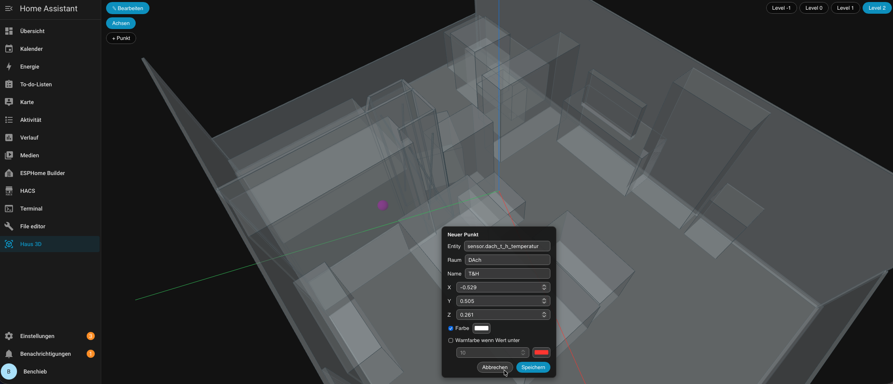

# Haus 3D Viewer

Home-Assistant-Custom-Integration mit eigenem Sidebar-Panel, das dein
gescanntes Haus als 3D-Modell (STL) anzeigt und Sensoren/Aktoren als
klickbare, farbcodierte Marker im Raum darstellt.



- Halbtransparentes Haus-Mesh mit Kantenlinien (bewusst kein Foto-Realismus)
- Mehrere Ebenen ("Etagen") mit Umschalter im Panel — mindestens eine Ebene
  ist Pflicht, beliebig viele weitere lassen sich per YAML ergänzen
- Marker-Farbe live aus dem Entity-State (Mapping konfigurierbar)
- Klick auf Marker öffnet den nativen Home-Assistant "Mehr Info"-Dialog
- Kamera-Steuerung per Maus/Touch (Zoom/Pan/Rotate)

## Voraussetzungen

Erfordert einen STL- und Positions-JSON-Export im unten dokumentierten
Format. Kompatible Scan-Exporte werden aktuell nur von **3DScan**
bereitgestellt (App Store).

## Installation

### Über HACS (Custom Repository)

1. HACS → Integrationen → ⋮ → *Benutzerdefinierte Repositories*
2. Repository-URL dieses Projekts eintragen, Kategorie *Integration*
3. "Haus 3D Viewer" installieren
4. Home Assistant neu starten

### Manuell

1. Ordner `custom_components/house3d_viewer/` in dein `/config/custom_components/`
   kopieren (z. B. per Samba/SSH-Add-on)
2. Home Assistant neu starten

## Konfiguration

In `configuration.yaml`:

```yaml
house3d_viewer:
  floors:
    - name: "Ebene 0"
      stl_path: /config/house3d/ebene0.stl
      positions_path: /config/house3d/ebene0-positions.json
    - name: "Ebene 1"
      stl_path: /config/house3d/ebene1.stl
      positions_path: /config/house3d/ebene1-positions.json
  state_colors:
    "on": "#2ecc71"
    "off": "#e74c3c"
    "unavailable": "#9e9e9e"
    "unknown": "#9e9e9e"
```

| Option | Pflicht | Beschreibung |
|---|---|---|
| `floors` | ja | Liste von Ebenen, mindestens ein Eintrag ist Pflicht |
| `floors[].id` | nein | Stabile ID der Ebene (z. B. für URLs). Wird sonst automatisch aus `name` abgeleitet |
| `floors[].name` | ja | Anzeigename im Ebenen-Umschalter, z. B. `"Ebene 0"` |
| `floors[].stl_path` | ja | Absoluter Pfad zur STL-Datei dieser Ebene |
| `floors[].positions_path` | ja | Absoluter Pfad zur Positions-JSON-Datei dieser Ebene (Schema siehe unten) |
| `state_colors` | nein | Mapping Entity-State → Hex-Farbe, gilt für alle Ebenen. Nicht abgedeckte States fallen auf `unknown` bzw. Grau zurück |

Um eine weitere Ebene hinzuzufügen, einfach einen neuen Eintrag unter
`floors:` ergänzen und Home Assistant neu starten. Ab zwei Ebenen erscheint
automatisch ein Umschalter oben rechts im Panel; bei nur einer Ebene wird er
ausgeblendet.

Nach dem Ändern der YAML-Konfiguration Home Assistant neu starten. Der
Reiter **"Haus 3D"** erscheint danach in der Sidebar.

### Scan-Dateien einspielen

Die STL- und Positions-JSON-Dateien landen am einfachsten per **Samba**
direkt im `/config`-Verzeichnis (z. B. Ordner `house3d/`) — voraussetzt,
das Samba-Add-on ist installiert und eingerichtet (siehe Add-on-Doku).
Danach einfach wie oben unter `floors[].stl_path` /
`floors[].positions_path` auf die kopierten Dateien verweisen.

## Positions-JSON-Schema

Dieses generische Format ist die einzige Schnittstelle der Integration —
sie trifft keine Annahmen über die Herkunft der Daten:

```json
{
  "coordinate_system": "right-handed, meters, origin = scan start point",
  "markers": [
    {
      "entity_id": "binary_sensor.tuer_wohnzimmer",
      "room": "Wohnzimmer",
      "x": 1.24,
      "y": 0.0,
      "z": 3.85,
      "label": "Fenstersensor"
    }
  ]
}
```

- `entity_id`: die Home-Assistant-Entity, deren State die Marker-Farbe bestimmt
- `room`: freier Text, aktuell nur informativ
- `x`, `y`, `z`: Position in Metern, `y` = Höhe
- `label`: Anzeigetext (aktuell nicht im UI gerendert, für zukünftige Tooltips reserviert)

## Testen mit Dummy-Daten

Im Ordner [`test_data/`](test_data/) liegen zwei einfache Testhaus-Würfel
mit je einem Beispiel-JSON (`ebene0-haus.stl`/`ebene0-positions.json` und
`ebene1-haus.stl`/`ebene1-positions.json`), mit denen sich das Panel inkl.
Ebenen-Umschalter ohne echten Scan testen lässt. Einfach in der YAML-Config
auf diese Dateien verweisen (siehe Beispiel oben).

## Nicht Teil dieser Integration

Die Erzeugung des Achsensystems bzw. die Umrechnung von Scan-Rohdaten in das
Positions-JSON erfolgt außerhalb dieser Integration, in einer separaten App.
Diese Integration setzt lediglich ein bereits fertiges STL + JSON-Paar
voraus.

## Lizenz

MIT, siehe [LICENSE](LICENSE).
