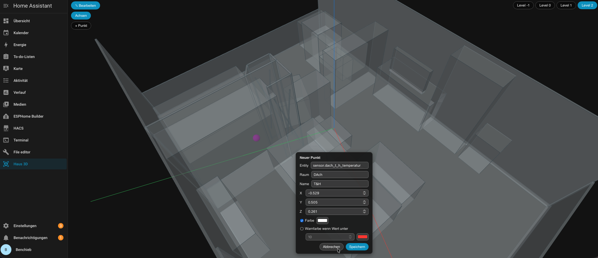

# 3D House Viewer

[](https://my.home-assistant.io/redirect/hacs_repository/?owner=benchieb-debug&repository=3D-House-Viewer&category=integration)

🇩🇪 [Deutsche Anleitung weiter unten](#deutsch)

A Home Assistant custom integration with its own sidebar panel that shows your
scanned house as a 3D model (STL) and places your sensors and actuators as
clickable, color-coded markers inside it.



- Semi-transparent house mesh with edge lines (deliberately not photorealistic)
- Multiple floors with a floor switcher in the panel — at least one floor is
  required, any number of further floors can be added in YAML
- Marker color follows the live entity state (mapping is configurable)
- Per-marker color override and a threshold rule (e.g. battery < 10 % → red)
- Place, move, recolor and delete markers directly in the panel (edit mode)
- Clicking a marker opens the native Home Assistant "more info" dialog
- Camera control with mouse/touch (zoom, pan, rotate) and optional X/Y/Z axes

## Requirements

- Home Assistant 2024.7.0 or newer
- An **STL** file of your house and a **positions JSON** file for each floor
  (format described below). Compatible STL exports are currently provided by the
  **Scan 3D** iOS app (App Store), but any STL works as long as the marker
  coordinates are in the same coordinate space as the model.

## Installation

### Via HACS (recommended)

1. Click the button at the top of this page — it opens this repository in your
   Home Assistant instance inside HACS. *(Or: HACS → ⋮ → **Custom repositories**
   → add `https://github.com/benchieb-debug/3D-House-Viewer` with type
   **Integration**.)*
2. Click **Download** (called *Install* in older HACS versions) for
   "3D House Viewer".
3. Restart Home Assistant.

### Manual

1. Copy the folder `custom_components/house3d_viewer/` into your Home Assistant
   `/config/custom_components/` directory (e.g. via the Samba or SSH add-on).
2. Restart Home Assistant.

## Configuration

Add this to your `configuration.yaml`:

```yaml
house3d_viewer:
  floors:
    - name: "Ground floor"
      stl_path: /config/house3d/ground-floor.stl
      positions_path: /config/house3d/ground-floor-positions.json
    - name: "First floor"
      stl_path: /config/house3d/first-floor.stl
      positions_path: /config/house3d/first-floor-positions.json
  state_colors:
    "on": "#2ecc71"
    "off": "#e74c3c"
    "unavailable": "#9e9e9e"
    "unknown": "#9e9e9e"
```

| Option | Required | Description |
|---|---|---|
| `floors` | yes | List of floors, at least one entry |
| `floors[].id` | no | Stable ID of the floor (used in URLs). Derived from `name` if omitted |
| `floors[].name` | yes | Label in the floor switcher, e.g. `"Ground floor"` |
| `floors[].stl_path` | yes | Absolute path to this floor's STL file |
| `floors[].positions_path` | yes | Absolute path to this floor's positions JSON file (schema below) |
| `state_colors` | no | Maps an entity state to a hex color, applies to all floors. States that are not listed fall back to the `unknown` color (grey) |

Notes:

- The STL and JSON files must exist when Home Assistant starts, otherwise the
  configuration is rejected.
- To add another floor, add a new entry under `floors:` and restart Home
  Assistant. With two or more floors a floor switcher appears at the top right
  of the panel; with a single floor it is hidden.
- After changing the YAML, restart Home Assistant. The sidebar entry
  **"Haus 3D"** appears afterwards.

### Getting your scan files onto Home Assistant

The easiest way is the **Samba** add-on: copy the STL and JSON files into a
folder inside `/config` (for example `/config/house3d/`) and point
`stl_path` / `positions_path` to them. See the Samba add-on documentation for
setting it up.

## Positions JSON schema

This generic format is the only interface of the integration — it makes no
assumptions about where the data comes from:

```json
{
  "coordinate_system": "right-handed, meters, origin = scan start point",
  "markers": [
    {
      "entity_id": "binary_sensor.living_room_window",
      "room": "Living room",
      "x": 1.24,
      "y": 0.0,
      "z": 3.85,
      "label": "Window sensor",
      "color": "#ef03f9",
      "threshold_below": 10,
      "threshold_color": "#ff3b30"
    }
  ]
}
```

| Field | Required | Description |
|---|---|---|
| `entity_id` | yes | The Home Assistant entity whose state drives the marker color |
| `x`, `y`, `z` | yes | Position in meters. In this file `y` is the **vertical** axis (height) |
| `room` | no | Free text, informational only |
| `label` | no | Free display text |
| `color` | no | Fixed hex color. If set, it always wins over the entity state |
| `threshold_below` + `threshold_color` | no | If the entity's numeric state is **below** `threshold_below`, the marker uses `threshold_color` (e.g. battery < 10 % → red). Both fields must be set |

Color resolution order: fixed `color` → threshold rule (only for numeric states)
→ `state_colors` mapping.

> **Axis labels:** The axes overlay in the panel and the marker editor label the
> vertical axis **Z** (Z points up) and the horizontal depth axis **Y**. The
> JSON file stores the raw values, so the editor's Y and Z fields appear swapped
> compared to the `y` and `z` values in the file.

## Editing markers in the panel

Markers can be created, moved, recolored and deleted directly in the panel, no
file editing needed:

1. Open the panel and click **"✎ Bearbeiten"** (edit mode). Editing is only
   possible while edit mode is active, to prevent accidental changes.
2. Add a marker or click an existing one. In the dialog you can set the
   position, an optional fixed color and an optional "warning color below value"
   rule, then save or delete.
3. Changes are written straight back into the floor's positions JSON file, so
   the file must be writable by Home Assistant.

> The panel's own labels (sidebar entry "Haus 3D", "✎ Bearbeiten", "Achsen", …)
> are currently in German. Translating the panel UI is planned.

## Trying it with sample data

The [`test_data/`](test_data/) folder contains sample files so you can test the
panel including the floor switcher without a real scan: two simple dummy houses
(`ebene0-*`, `ebene1-*`) and further sample scans (`Level2.*`,
`RoomPlanE2F60CF3.*`), each as an STL plus a matching positions JSON. Point your
YAML configuration to these files (see the example above).

## Out of scope

Creating the coordinate system and converting raw scan data into the positions
JSON happens outside of this integration, in a separate app. This integration
only expects a finished STL + JSON pair.

---

# Deutsch

Home-Assistant-Custom-Integration mit eigenem Sidebar-Panel, das dein
gescanntes Haus als 3D-Modell (STL) anzeigt und Sensoren/Aktoren als
klickbare, farbcodierte Marker im Raum darstellt.

- Halbtransparentes Haus-Mesh mit Kantenlinien (bewusst kein Foto-Realismus)
- Mehrere Ebenen ("Etagen") mit Umschalter im Panel — mindestens eine Ebene
  ist Pflicht, beliebig viele weitere lassen sich per YAML ergänzen
- Marker-Farbe live aus dem Entity-State (Mapping konfigurierbar)
- Klick auf Marker öffnet den nativen Home-Assistant "Mehr Info"-Dialog
- Kamera-Steuerung per Maus/Touch (Zoom/Pan/Rotate)

## Voraussetzungen

Erfordert einen STL- und Positions-JSON-Export im unten dokumentierten
Format. Kompatible Scan-Exporte werden aktuell nur von **3DScan**
bereitgestellt (App Store).

## Installation

### Über HACS (Custom Repository)

1. HACS → Integrationen → ⋮ → *Benutzerdefinierte Repositories*
2. Repository-URL dieses Projekts eintragen, Kategorie *Integration*
3. "3D House Viewer" installieren
4. Home Assistant neu starten

### Manuell

1. Ordner `custom_components/house3d_viewer/` in dein `/config/custom_components/`
   kopieren (z. B. per Samba/SSH-Add-on)
2. Home Assistant neu starten

## Konfiguration

In `configuration.yaml`:

```yaml
house3d_viewer:
  floors:
    - name: "Ebene 0"
      stl_path: /config/house3d/ebene0.stl
      positions_path: /config/house3d/ebene0-positions.json
    - name: "Ebene 1"
      stl_path: /config/house3d/ebene1.stl
      positions_path: /config/house3d/ebene1-positions.json
  state_colors:
    "on": "#2ecc71"
    "off": "#e74c3c"
    "unavailable": "#9e9e9e"
    "unknown": "#9e9e9e"
```

| Option | Pflicht | Beschreibung |
|---|---|---|
| `floors` | ja | Liste von Ebenen, mindestens ein Eintrag ist Pflicht |
| `floors[].id` | nein | Stabile ID der Ebene (z. B. für URLs). Wird sonst automatisch aus `name` abgeleitet |
| `floors[].name` | ja | Anzeigename im Ebenen-Umschalter, z. B. `"Ebene 0"` |
| `floors[].stl_path` | ja | Absoluter Pfad zur STL-Datei dieser Ebene |
| `floors[].positions_path` | ja | Absoluter Pfad zur Positions-JSON-Datei dieser Ebene (Schema siehe unten) |
| `state_colors` | nein | Mapping Entity-State → Hex-Farbe, gilt für alle Ebenen. Nicht abgedeckte States fallen auf `unknown` bzw. Grau zurück |

Um eine weitere Ebene hinzuzufügen, einfach einen neuen Eintrag unter
`floors:` ergänzen und Home Assistant neu starten. Ab zwei Ebenen erscheint
automatisch ein Umschalter oben rechts im Panel; bei nur einer Ebene wird er
ausgeblendet.

Nach dem Ändern der YAML-Konfiguration Home Assistant neu starten. Der
Reiter **"Haus 3D"** erscheint danach in der Sidebar.

### Scan-Dateien einspielen

Die STL- und Positions-JSON-Dateien landen am einfachsten per **Samba**
direkt im `/config`-Verzeichnis (z. B. Ordner `house3d/`) — voraussetzt,
das Samba-Add-on ist installiert und eingerichtet (siehe Add-on-Doku).
Danach einfach wie oben unter `floors[].stl_path` /
`floors[].positions_path` auf die kopierten Dateien verweisen.

## Positions-JSON-Schema

Dieses generische Format ist die einzige Schnittstelle der Integration —
sie trifft keine Annahmen über die Herkunft der Daten:

```json
{
  "coordinate_system": "right-handed, meters, origin = scan start point",
  "markers": [
    {
      "entity_id": "binary_sensor.tuer_wohnzimmer",
      "room": "Wohnzimmer",
      "x": 1.24,
      "y": 0.0,
      "z": 3.85,
      "label": "Fenstersensor"
    }
  ]
}
```

- `entity_id`: die Home-Assistant-Entity, deren State die Marker-Farbe bestimmt
- `room`: freier Text, aktuell nur informativ
- `x`, `y`, `z`: Position in Metern, `y` = Höhe
- `label`: Anzeigetext
- Optional pro Marker: `color` (feste Farbe, hat Vorrang vor dem Entity-State)
  sowie `threshold_below` + `threshold_color` (z. B. Batterie < 10 % → Rot).
  Marker lassen sich auch direkt im Panel über **"✎ Bearbeiten"** anlegen,
  verschieben und löschen (siehe englischer Abschnitt oben).

## Testen mit Dummy-Daten

Im Ordner [`test_data/`](test_data/) liegen zwei einfache Testhaus-Würfel
mit je einem Beispiel-JSON (`ebene0-haus.stl`/`ebene0-positions.json` und
`ebene1-haus.stl`/`ebene1-positions.json`), mit denen sich das Panel inkl.
Ebenen-Umschalter ohne echten Scan testen lässt. Einfach in der YAML-Config
auf diese Dateien verweisen (siehe Beispiel oben).

## Nicht Teil dieser Integration

Die Erzeugung des Achsensystems bzw. die Umrechnung von Scan-Rohdaten in das
Positions-JSON erfolgt außerhalb dieser Integration, in einer separaten App.
Diese Integration setzt lediglich ein bereits fertiges STL + JSON-Paar
voraus.

---

## Support / Unterstützen

If this integration is useful to you, a donation is much appreciated.
Wenn dir die Integration was wert ist, freue ich mich über eine Spende:

| | Address / Adresse |
|---|---|
| ₿ Bitcoin (Taproot) | `bc1pxt3hfsqua095qe2xprhqt2d2wc9h88w0w75jrc4hzckdpwml8j8svzpqtz` |
| Ξ Ethereum | `0x457c5EB013635dA90365Dd80D8139737701719a4` |
| BNB Smart Chain (BEP20) | `0x457c5EB013635dA90365Dd80D8139737701719a4` |
| Solana | `64czaeXhwxtG3K3BrX1w7scZWDbdZaKTxvDHVDv9qPQC` |

## License / Lizenz

MIT, see / siehe [LICENSE](LICENSE).
