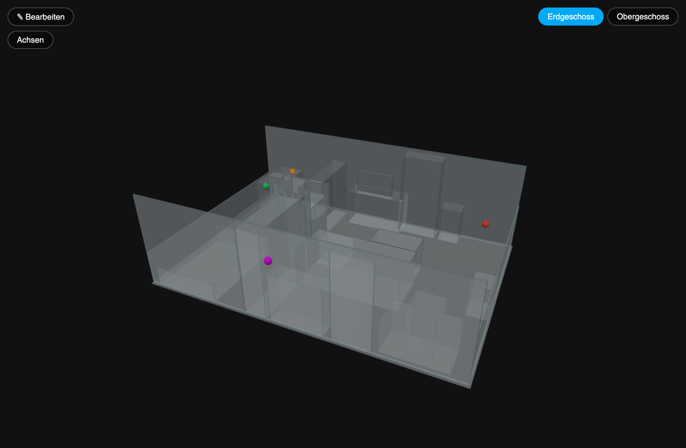
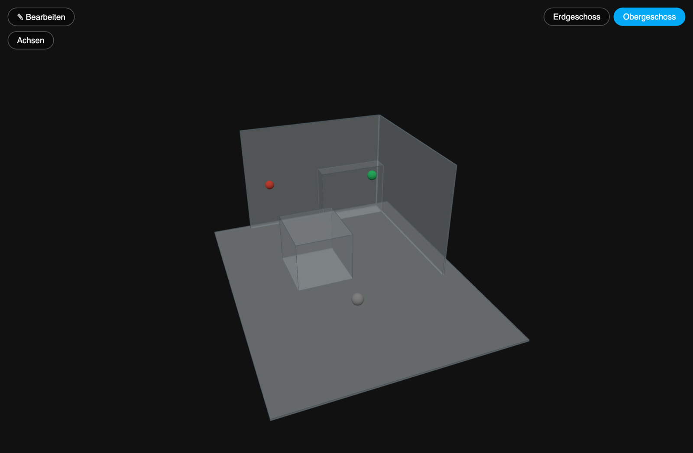
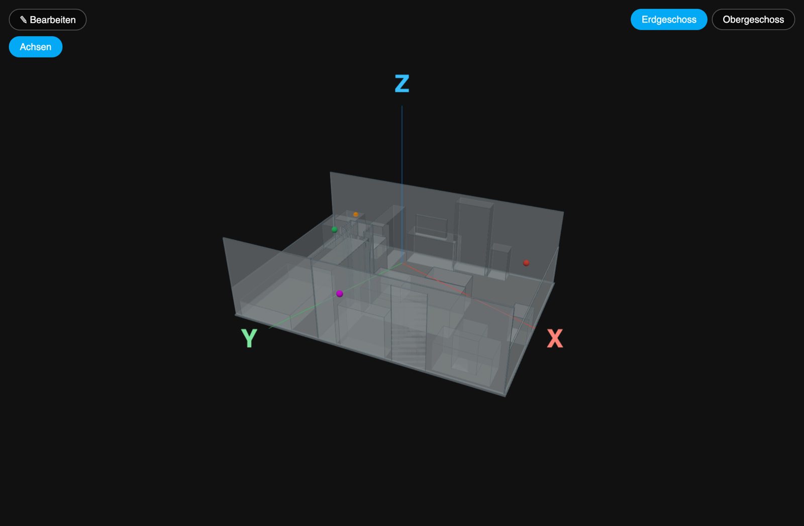
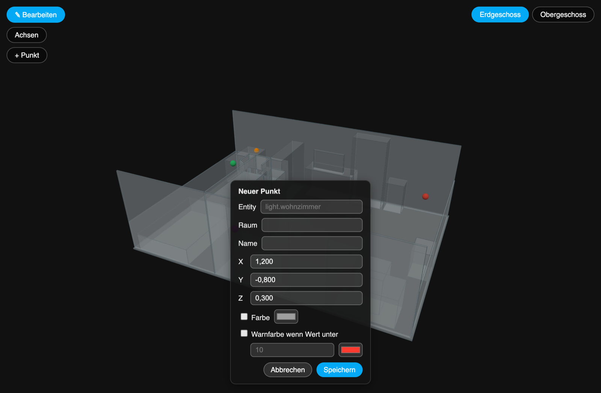
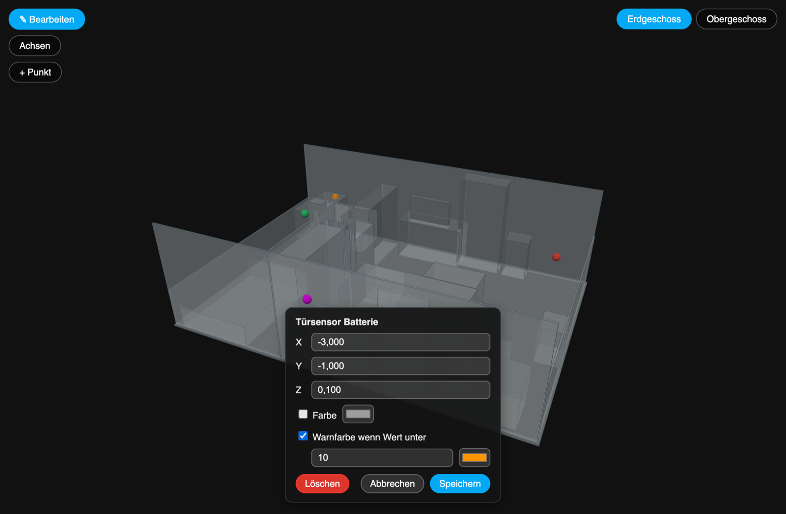

# Installationsanleitung

🇬🇧 [English guide](INSTALLATION.md) · [Zurück zur README](../README.md)

Diese Anleitung führt dich von null bis zu einem funktionierenden 3D-Modell
deines Zuhauses mit Live-Markern für deine Sensoren in Home Assistant. Alle
Screenshots des Panels zeigen Beispieldaten (eine Demo-Wohnung mit
Demo-Entities).

**Inhalt**

1. [Was du brauchst](#was-du-brauchst)
2. [Schritt 1 – Integration installieren](#schritt-1--integration-installieren)
3. [Schritt 2 – Scan-Dateien besorgen](#schritt-2--scan-dateien-besorgen)
4. [Schritt 3 – Dateien auf Home Assistant kopieren](#schritt-3--dateien-auf-home-assistant-kopieren)
5. [Schritt 4 – Integration konfigurieren](#schritt-4--integration-konfigurieren)
6. [Schritt 5 – Panel öffnen](#schritt-5--panel-öffnen)
7. [Schritt 6 – Sensoren platzieren](#schritt-6--sensoren-platzieren)
8. [Koordinaten im Detail](#koordinaten-im-detail)
9. [Fehlersuche](#fehlersuche)

## Was du brauchst

- **Home Assistant 2024.7.0 oder neuer** sowie entweder [HACS](https://hacs.xyz)
  (empfohlen) oder Dateizugriff auf deinen `/config`-Ordner.
- **Eine STL-Datei pro Etage** deines Hauses und **eine Positions-JSON-Datei
  pro Etage** (darin steht, wo deine Sensoren im Modell sitzen).
- Die iOS-App **Scan 3D** (App Store) erzeugt genau diese Dateien aus einem
  Raum-Scan. Jede andere STL-Datei funktioniert ebenfalls, siehe
  [Schritt 2](#schritt-2--scan-dateien-besorgen).

## Schritt 1 – Integration installieren

### Mit HACS (empfohlen)

1. Klicke auf diesen Button. Er öffnet das Repository in deiner Home-Assistant-
   Instanz, innerhalb von HACS:

   [](https://my.home-assistant.io/redirect/hacs_repository/?owner=benchieb-debug&repository=3D-House-Viewer&category=integration)

   *Lieber von Hand?* Öffne in Home Assistant **HACS**, klicke oben rechts auf
   das **⋮**-Menü, wähle **Benutzerdefinierte Repositories**, trage
   `https://github.com/benchieb-debug/3D-House-Viewer` ein, wähle den Typ
   **Integration** und klicke auf **Hinzufügen**. Suche danach in HACS nach
   "3D House Viewer".
2. Klicke auf **Herunterladen** (ältere HACS-Versionen nennen es *Installieren*)
   und bestätige.
3. **Starte Home Assistant neu** (*Einstellungen → System → Neustart*).

### Manuelle Installation

Kopiere den Ordner `custom_components/house3d_viewer/` aus diesem Repository
nach `/config/custom_components/` auf deinem Home Assistant (zum Beispiel mit
dem Samba- oder SSH-Add-on) und starte Home Assistant neu.

## Schritt 2 – Scan-Dateien besorgen

### Mit der Scan-3D-App (iOS)

1. Scanne eine Etage, zum Beispiel im Modus **RoomPlan • Raum**.
2. Schalte auf dem Scan-Bildschirm den Schalter **HA** ein. Wenn du den Scan
   beendest, legt die App neben dem Ergebnis eine leere Positionsdatei namens
   `<Name>_positions.json` an.
3. Wähle **STL** als Ausgabeformat, öffne das Modell im Viewer und exportiere
   es. (Der STL-Export ist in der iOS-App verfügbar.)
4. Wiederhole das für jede Etage.

Danach hast du pro Etage eine `.stl`-Datei und eine Positions-`.json`-Datei.

### Ohne die App

Jedes STL-Modell einer Etage funktioniert. Die Positionsdatei legst du selbst
als Textdatei mit diesem Inhalt an, die Marker ergänzt du später im Panel:

```json
{ "markers": [] }
```

> Die Positionsdatei muss gültiges JSON enthalten. Eine komplett leere Datei
> (0 Byte) führt zu einem Fehler.

## Schritt 3 – Dateien auf Home Assistant kopieren

Lege die Dateien in einen Ordner innerhalb deines Home-Assistant-Verzeichnisses
`/config`, zum Beispiel `/config/house3d/`.

Am einfachsten geht das mit dem **Samba-Share-Add-on**: Öffne von deinem
Computer aus die Freigabe `config` deines Home Assistant (zum Beispiel
`smb://homeassistant.local/config` am Mac oder `\\homeassistant.local\config`
unter Windows), lege den Ordner `house3d` an und kopiere deine Dateien hinein.
Auch die Add-ons *File editor* oder *Studio Code Server* funktionieren.

```
/config/house3d/
├── erdgeschoss.stl
├── erdgeschoss-positions.json
├── obergeschoss.stl
└── obergeschoss-positions.json
```

> **Die Dateien müssen existieren, bevor Home Assistant startet**, sonst lehnt
> Home Assistant die Konfiguration im nächsten Schritt ab.

## Schritt 4 – Integration konfigurieren

Füge dies in deine `configuration.yaml` ein und passe Namen und Pfade an deine
Dateien an. Verwende absolute Pfade.

```yaml
house3d_viewer:
  floors:
    - name: "Erdgeschoss"
      stl_path: /config/house3d/erdgeschoss.stl
      positions_path: /config/house3d/erdgeschoss-positions.json
    - name: "Obergeschoss"
      stl_path: /config/house3d/obergeschoss.stl
      positions_path: /config/house3d/obergeschoss-positions.json
  state_colors:
    "on": "#2ecc71"
    "off": "#e74c3c"
    "unavailable": "#9e9e9e"
    "unknown": "#9e9e9e"
```

- `floors` braucht mindestens einen Eintrag. Jede weitere Etage ist ein
  weiterer Eintrag.
- `state_colors` ist optional und ordnet einem Entity-Zustand eine Marker-Farbe
  zu. Nicht aufgeführte Zustände verwenden die Farbe von `unknown` (Grau).
- Die Positionsdatei muss **nicht** einen bestimmten Namen haben, nur die Pfade
  hier müssen stimmen.

Prüfe die Datei vor dem Neustart: *Entwicklerwerkzeuge → YAML →
**Konfiguration prüfen***. Starte danach **Home Assistant neu**.

## Schritt 5 – Panel öffnen

Nach dem Neustart erscheint in der Seitenleiste ein neuer Eintrag: **Haus 3D**
(bei englischer Home-Assistant-Sprache heißt er **3D House**). Öffne ihn:



- **Drehen:** mit der Maus oder einem Finger ziehen.
- **Zoomen:** Mausrad oder zwei Finger zusammen-/auseinanderziehen.
- **Verschieben:** rechte Maustaste oder zwei Finger.
- **Klick auf einen Marker** öffnet den normalen Home-Assistant-Dialog der
  Entity (Verlauf, Steuerung, Einstellungen).

Die Marker-Farben folgen dem Live-Zustand der Entity: In der Demo ist der grüne
Punkt ein eingeschaltetes Licht, der rote ein Fenstersensor, der "aus" ist. Ein
Marker mit fester Farbe behält sie (der magentafarbene Punkt), und der orange
Punkt ist ein Batteriesensor, dessen Wert unter seinem Warn-Grenzwert liegt.

### Zwischen Etagen wechseln

Bei zwei oder mehr Etagen erscheint oben rechts ein Etagen-Umschalter. Jede
Etage hat ihr eigenes Modell und ihre eigenen Marker.



### Achsen anzeigen

Der Button **Achsen** zeigt die Achsen X (rot), Y (grün) und Z (blau). **Z zeigt
nach oben.** Die Achsen beginnen in der Mitte des Modells.



## Schritt 6 – Sensoren platzieren

Marker werden im **Bearbeiten-Modus** angelegt und geändert. Außerhalb davon
kann nichts versehentlich verschoben oder gelöscht werden.

### 1. Bearbeiten-Modus einschalten

Klicke auf **✎ Bearbeiten**. Zwei Dinge ändern sich: Der Button wird blau, und
ein Button **+ Punkt** erscheint.


### 2. Marker hinzufügen

1. Klicke auf **+ Punkt**. Ein Hinweis fordert dich auf, auf das Modell zu
   tippen.
2. Klicke auf die Stelle im Modell, an der der Sensor oder das Gerät ist.
3. Fülle den Dialog aus und klicke auf **Speichern**:



| Feld | Bedeutung |
|---|---|
| **Entity** | Die Home-Assistant-Entity, zum Beispiel `light.wohnzimmer` |
| **Raum**, **Name** | Optionaler Text. Der Name wird später beim Bearbeiten zum Titel des Dialogs |
| **X / Y / Z** | Position in Metern, aus deinem Klick vorausgefüllt. Hier kannst du feinjustieren |
| **Farbe** | Optionale feste Farbe. Wenn gesetzt, hat sie immer Vorrang vor dem Entity-Zustand |
| **Warnfarbe wenn Wert unter** | Optional. Hat die Entity eine Zahl als Zustand und fällt sie unter den Wert, nimmt der Marker die Warnfarbe an (zum Beispiel Batterie < 10 % → Orange) |

### 3. Marker ändern oder löschen

Klicke im Bearbeiten-Modus auf einen bestehenden Marker. Wie bei jedem Klick auf
einen Marker öffnet sich der Home-Assistant-Dialog der Entity, zusätzlich ein
kürzerer Bearbeiten-Dialog mit Position, Farben und einem Button **Löschen**.
Entity, Raum und Name lassen sich hier nicht ändern: Lösche den Marker und lege
ihn neu an, wenn einer davon falsch ist.



Klicke erneut auf **✎ Bearbeiten**, um den Modus zu verlassen. Alle Änderungen
werden direkt in die Positionsdatei der Etage geschrieben, diese Datei muss
also für Home Assistant beschreibbar sein.

## Koordinaten im Detail

Das brauchst du nur, wenn du die Positionsdatei von Hand bearbeitest.

- Positionen sind in **Metern** angegeben, gemessen von der **Mitte der
  Begrenzungsbox des STL-Modells** (das Panel zentriert das Modell immer).
- In der **JSON-Datei** ist `y` die **senkrechte** Achse (Höhe). In den Achsen
  des Panels und im Bearbeiten-Dialog heißt die senkrechte Achse **Z**, daher
  sind die Felder Y und Z im Dialog gegenüber der Datei vertauscht. Beispiel:
  Ein Marker, der als `"x": -3.0, "y": 0.1, "z": -1.0` gespeichert ist, erscheint
  im Dialog als X = -3,000, Y = -1,000, Z = 0,100.
- Das Feld `coordinate_system` in der Datei (die App schreibt
  `arkit_meters_y_up`) ist nur informativ und wird nicht ausgewertet.

Marker-Felder in der Datei:

```json
{
  "entity_id": "sensor.tuersensor_batterie",
  "label": "Türsensor Batterie",
  "room": "Flur",
  "x": -3.0, "y": 0.1, "z": -1.0,
  "color": "#ef03f9",
  "threshold_below": 10,
  "threshold_color": "#ff9500"
}
```

`color` und das Paar `threshold_below` + `threshold_color` sind optional. Die
Farbe wird in dieser Reihenfolge bestimmt: feste `color` → Grenzwert-Regel (nur
bei Zahlenwerten) → `state_colors`.

## Fehlersuche

| Problem | Was du prüfen kannst |
|---|---|
| Home Assistant meldet eine ungültige Konfiguration | `stl_path` und `positions_path` müssen absolute Pfade zu existierenden Dateien sein, und `floors` braucht mindestens einen Eintrag. Führe *Konfiguration prüfen* aus. |
| Kein Eintrag in der Seitenleiste | Starte Home Assistant nach der Installation und nach Änderungen an der YAML neu. Suche in *Einstellungen → System → Protokolle* nach `house3d_viewer`. |
| Das Panel zeigt "Fehler beim Laden der Ebenen" oder "Fehler beim Laden der Haus-Daten" | Öffne die Browser-Konsole (F12) für Details. Meist ist die STL- oder JSON-Datei nicht lesbar oder das JSON ungültig. Lade mit Cmd/Strg+Shift+R neu. |
| Das Modell ist da, aber die Marker schweben daneben | Marker-Positionen beziehen sich auf die Mitte des Modells. Verschiebe sie im Bearbeiten-Modus. |
| Ein Marker bleibt grau | Die `entity_id` existiert nicht, oder ihr Zustand hat keinen Eintrag in `state_colors` (dann gilt die `unknown`-Farbe). |
| Speichern eines Markers schlägt fehl | Die Positionsdatei muss für Home Assistant beschreibbar sein. |
| Panel-Text in der falschen Sprache | Das Panel folgt deiner Home-Assistant-Benutzersprache (Deutsch oder Englisch, andere Sprachen zeigen Englisch). |

Etwas anderes? Bitte [öffne ein Issue](https://github.com/benchieb-debug/3D-House-Viewer/issues).
