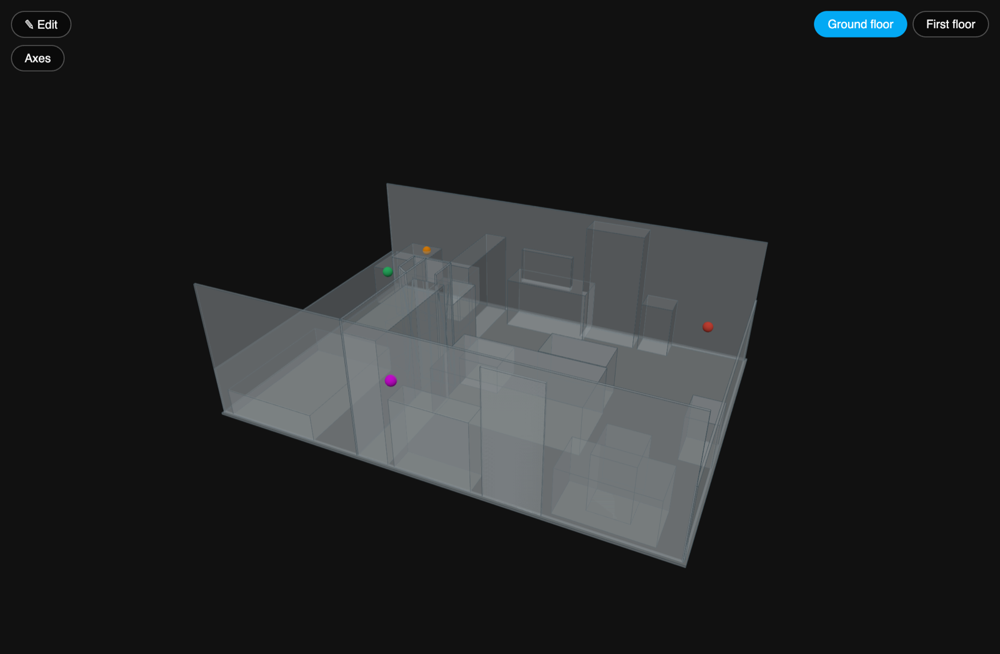
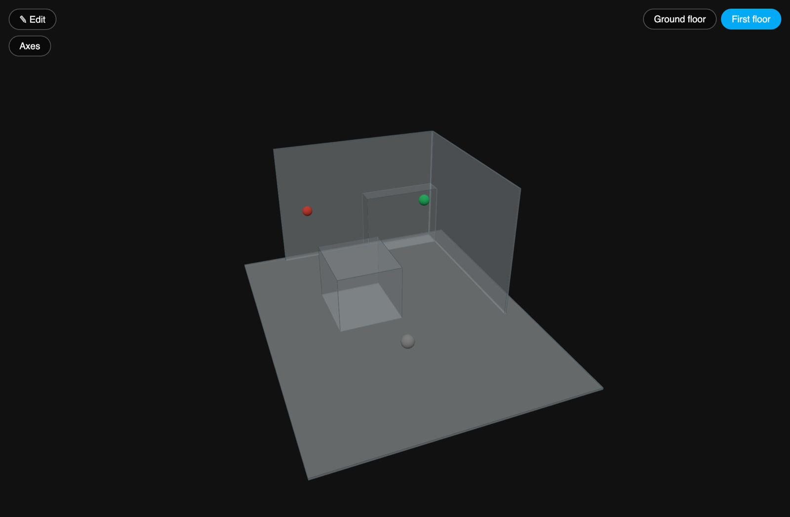
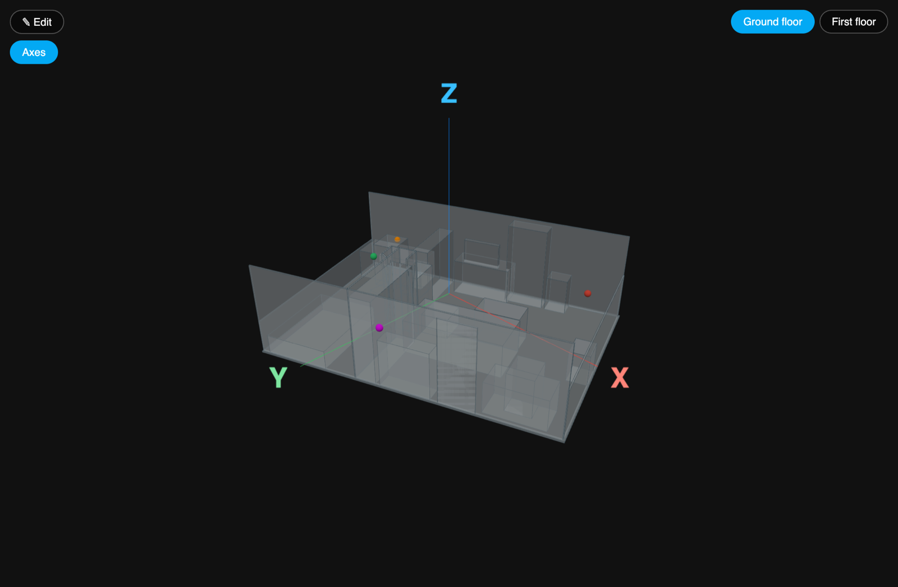
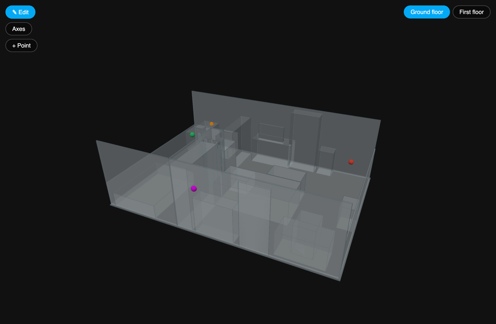
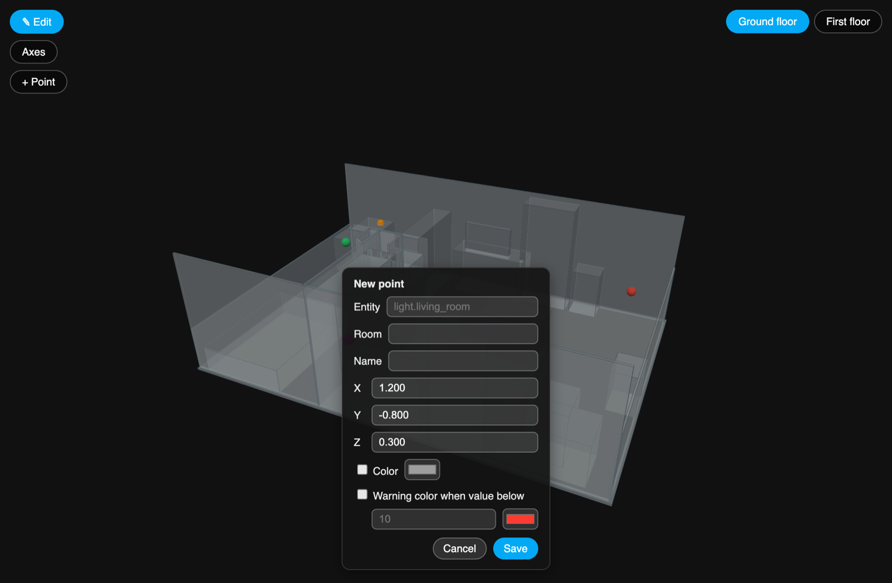
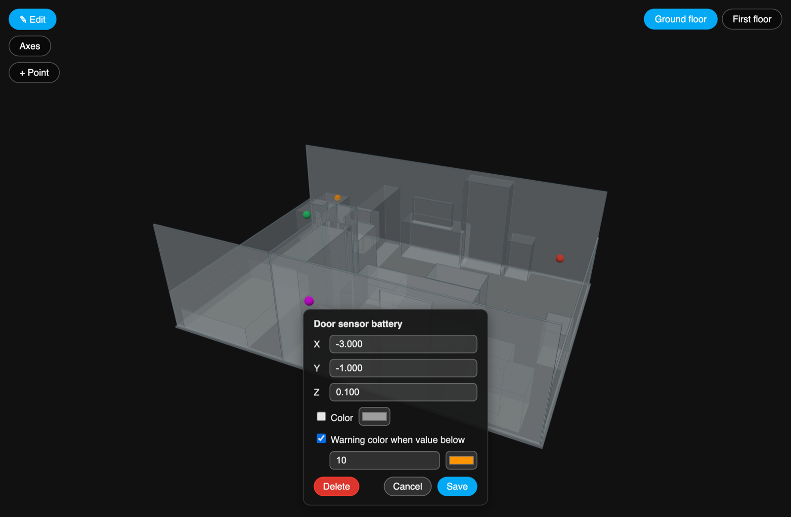

# Installation guide

🇩🇪 [Deutsche Anleitung](INSTALLATION.de.md) · [Back to the README](../README.md)

This guide takes you from nothing to a working 3D model of your home with live
sensor markers in Home Assistant. All screenshots of the panel use sample data
(a demo apartment with demo entities).

**Contents**

1. [What you need](#what-you-need)
2. [Step 1 – Install the integration](#step-1--install-the-integration)
3. [Step 2 – Get your scan files](#step-2--get-your-scan-files)
4. [Step 3 – Copy the files to Home Assistant](#step-3--copy-the-files-to-home-assistant)
5. [Step 4 – Configure the integration](#step-4--configure-the-integration)
6. [Step 5 – Open the panel](#step-5--open-the-panel)
7. [Step 6 – Place your sensors](#step-6--place-your-sensors)
8. [Coordinates in detail](#coordinates-in-detail)
9. [Troubleshooting](#troubleshooting)

## What you need

- **Home Assistant 2024.7.0 or newer**, and either [HACS](https://hacs.xyz)
  (recommended) or file access to your `/config` folder.
- **One STL file per floor** of your home, plus **one positions JSON file per
  floor** (it stores where your sensors sit in the model).
- The **Scan 3D** iOS app (App Store) creates exactly these files from a room
  scan. Any other STL works too, see [Step 2](#step-2--get-your-scan-files).

## Step 1 – Install the integration

### With HACS (recommended)

1. Click this button. It opens the repository in your Home Assistant instance,
   inside HACS:

   [](https://my.home-assistant.io/redirect/hacs_repository/?owner=benchieb-debug&repository=3D-House-Viewer&category=integration)

   *Prefer to do it by hand?* In Home Assistant open **HACS**, click the **⋮**
   menu at the top right, choose **Custom repositories**, enter
   `https://github.com/benchieb-debug/3D-House-Viewer`, select the type
   **Integration** and click **Add**. Then search HACS for "3D House Viewer".
2. Click **Download** (older HACS versions call it *Install*) and confirm.
3. **Restart Home Assistant** (*Settings → System → Restart*).

### Manual installation

Copy the folder `custom_components/house3d_viewer/` from this repository into
`/config/custom_components/` on your Home Assistant (for example with the Samba
or SSH add-on), then restart Home Assistant.

## Step 2 – Get your scan files

### With the Scan 3D app (iOS)

1. Scan one floor, for example with the **RoomPlan • Room** mode.
2. On the scan screen, switch the **HA** toggle on. When you finish the scan,
   the app writes an empty positions file named `<name>_positions.json` next to
   the result.
3. Choose **STL** as the output format, open the model in the viewer and export
   it. (STL export is available in the iOS app.)
4. Repeat for every floor.

You now have, per floor, an `.stl` file and a positions `.json` file.

### Without the app

Any STL model of a floor works. Create the positions file yourself, as a text
file with this content, and add the markers later in the panel:

```json
{ "markers": [] }
```

> The positions file must contain valid JSON. A completely empty (0 byte) file
> causes an error.

## Step 3 – Copy the files to Home Assistant

Put the files into a folder inside your Home Assistant `/config` directory,
for example `/config/house3d/`.

The easiest way is the **Samba share** add-on: open the `config` share of your
Home Assistant from your computer (for example `smb://homeassistant.local/config`
on a Mac or `\\homeassistant.local\config` on Windows), create the folder
`house3d` and copy your files into it. The *File editor* or *Studio Code Server*
add-ons work as well.

```
/config/house3d/
├── ground-floor.stl
├── ground-floor-positions.json
├── first-floor.stl
└── first-floor-positions.json
```

> **The files must exist before Home Assistant starts**, otherwise it rejects
> the configuration in the next step.

## Step 4 – Configure the integration

Add this to your `configuration.yaml` and adjust names and paths to your files.
Use absolute paths.

```yaml
house3d_viewer:
  floors:
    - name: "Ground floor"
      stl_path: /config/house3d/ground-floor.stl
      positions_path: /config/house3d/ground-floor-positions.json
    - name: "First floor"
      stl_path: /config/house3d/first-floor.stl
      positions_path: /config/house3d/first-floor-positions.json
  state_colors:
    "on": "#2ecc71"
    "off": "#e74c3c"
    "unavailable": "#9e9e9e"
    "unknown": "#9e9e9e"
```

- `floors` needs at least one entry. Each further floor is one more entry.
- `state_colors` is optional and maps an entity state to a marker color. States
  that are not listed use the `unknown` color (grey).
- The positions file does **not** have to have a specific name, only the paths
  here must match.

Before restarting, check the file: *Developer tools → YAML → **Check
configuration***. Then **restart Home Assistant** again.

## Step 5 – Open the panel

After the restart a new entry appears in the sidebar: **3D House** (named
**Haus 3D** if your Home Assistant language is German). Open it:



- **Rotate:** drag with the mouse or one finger.
- **Zoom:** mouse wheel or pinch.
- **Pan:** right mouse button or two fingers.
- **Click a marker** to open the normal Home Assistant dialog of that entity
  (history, controls, settings).

Marker colors follow the live state of the entity: in the demo, the green dot
is a light that is on, the red dot a window sensor that is off. A marker with
a fixed color keeps it (the magenta dot), and the orange dot is a battery
sensor whose value is below its warning threshold.

### Switch between floors

With two or more floors, a floor switcher appears at the top right. Each floor
has its own model and its own markers.



### Show the axes

The **Axes** button shows the X (red), Y (green) and Z (blue) axes. **Z points
up.** The axes start at the center of the model.



## Step 6 – Place your sensors

Markers are created and edited in **edit mode**. Outside of edit mode, nothing
can be moved or deleted by accident.

### 1. Switch on edit mode

Click **✎ Edit**. Two things change: the button turns blue and a **+ Point**
button appears.



### 2. Add a marker

1. Click **+ Point**. A hint asks you to tap the model.
2. Click the spot in the model where the sensor or device is.
3. Fill in the dialog and click **Save**:



| Field | Meaning |
|---|---|
| **Entity** | The Home Assistant entity, for example `light.living_room` |
| **Room**, **Name** | Optional text. The name becomes the title of the dialog when you edit the marker later |
| **X / Y / Z** | Position in meters, pre-filled from where you clicked. Fine-tune it here |
| **Color** | Optional fixed color. If set, it always wins over the entity state |
| **Warning color when value below** | Optional. If the entity has a number as its state and it falls below the value, the marker takes the warning color (for example battery < 10 % → orange) |

### 3. Change or delete a marker

In edit mode, click an existing marker. As with every click on a marker, the
Home Assistant dialog of the entity opens, and additionally a shorter edit
dialog with the position, the colors and a **Delete** button. Entity, room and
name cannot be changed here: delete the marker and create it again if one of
them is wrong.



Click **✎ Edit** again to leave edit mode. All changes are written straight
into the floor's positions file, so that file must be writable by Home
Assistant.

## Coordinates in detail

You only need this if you edit the positions file by hand.

- Positions are in **meters**, measured from the **center of the STL model's
  bounding box** (the panel always centers the model).
- In the **JSON file**, `y` is the **vertical** axis (height). In the panel's
  axes and in the edit dialog the vertical axis is labeled **Z**, so the Y and
  Z fields of the dialog are swapped compared to the file. Example: a marker
  stored as `"x": -3.0, "y": 0.1, "z": -1.0` shows as X = -3.000, Y = -1.000,
  Z = 0.100 in the dialog.
- The `coordinate_system` field in the file (the app writes
  `arkit_meters_y_up`) is informational only and is not evaluated.

Marker fields in the file:

```json
{
  "entity_id": "sensor.door_sensor_battery",
  "label": "Door sensor battery",
  "room": "Hall",
  "x": -3.0, "y": 0.1, "z": -1.0,
  "color": "#ef03f9",
  "threshold_below": 10,
  "threshold_color": "#ff9500"
}
```

`color` and the pair `threshold_below` + `threshold_color` are optional. The
color is chosen in this order: fixed `color` → threshold rule (numeric states
only) → `state_colors`.

## Troubleshooting

| Problem | What to check |
|---|---|
| Home Assistant says the configuration is invalid | `stl_path` and `positions_path` must be absolute paths to files that exist, and `floors` needs at least one entry. Run *Check configuration*. |
| No sidebar entry | Restart Home Assistant after installing and after editing the YAML. Look for `house3d_viewer` in *Settings → System → Logs*. |
| Panel shows "Failed to load floors" or "Failed to load house data" | Open the browser console (F12) for details. Usually the STL or JSON file is unreadable or the JSON is invalid. Reload with Cmd/Ctrl+Shift+R. |
| Model is there but markers float next to it | Marker positions are relative to the center of the model. Move them in edit mode. |
| A marker stays grey | The `entity_id` does not exist, or its state has no entry in `state_colors` (it then uses the `unknown` color). |
| Saving a marker fails | The positions file must be writable by Home Assistant. |
| Panel text is in the wrong language | The panel follows your Home Assistant user language (English or German, other languages show English). |

Something else? Please [open an issue](https://github.com/benchieb-debug/3D-House-Viewer/issues).
